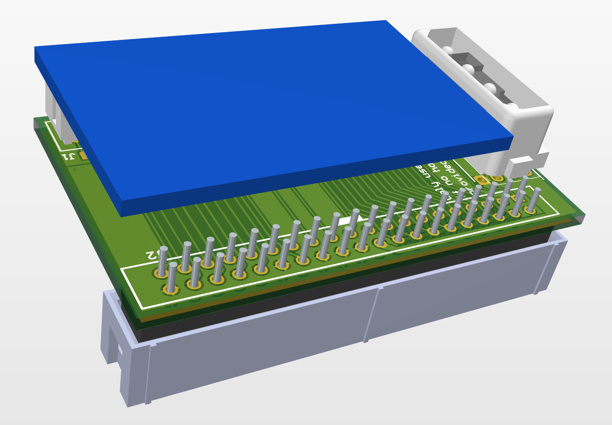

# IDE 44 pin male to 40 pin female adapter

March 2023

A simple adapter to convert a 44pin IDE device for an IDE 40pin host.
Nominally this is for plugging 'DOM' devices in to Acorn A5000 / IDE cards without additional cables.

There are two layouts (left and right side power inputs) each with three power populations (pin20 from the 40pin IDE, 'IDE' Molex power, or 'Berg' floppy power).

Both 'left' and 'right' designs have been tested under some significant load with 'Apacer' DOMs and found to operate reliably.

## Licence

No warranty is provided, and this work is used at your own risk.  

Licenced as CC BY-SA 3.0

Copyright 2023 Ian Jeffray

